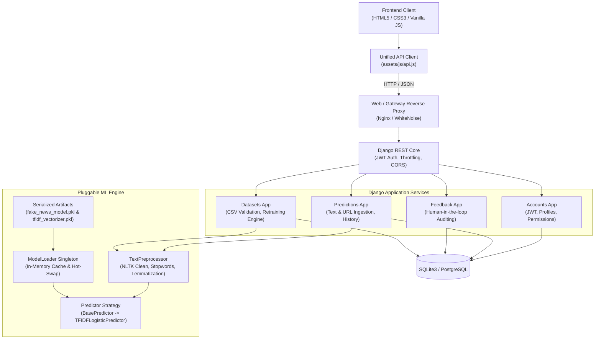

<div align="center">

# VERIFAI
### Enterprise AI-Powered Fake News Detection & Natural Language Forensic System

[](https://github.com/siyabahmad13/verifai-fake-news-detection/actions/workflows/ci.yml)
[](https://www.python.org/)
[](https://www.djangoproject.com/)
[](https://www.django-rest-framework.org/)
[](https://scikit-learn.org/)
[](LICENSE)
[]()

**Explainable Artificial Intelligence (XAI) platform engineered to detect misinformation, sensationalist framing, and unverified digital claims with token-level forensic diagnostics.**

[Live Interactive Workbench](#frontend-user-interface) • [Architecture](#system-architecture) • [Quick Start](#quick-start-guide) • [Model Replacement Guide](#how-to-replace-or-retrain-the-machine-learning-model) • [API Reference](#api-reference-endpoints) • [Docker Deployment](#docker-production-deployment)

</div>

---

## Executive Overview

**VERIFAI** is an end-to-end full-stack software system designed for newsrooms, intelligence analysts, and academic researchers. While standard fake news detectors act as black boxes returning arbitrary probabilities, VERIFAI prioritizes **explainability (XAI)** — highlighting sensationalist triggers, attributing journalistic provenance, providing readability indices, and generating tamper-proof audit trails.

The platform is designed with a **strictly decoupled machine learning engine**: the serving layer, database schemas, and client interfaces communicate with an abstract model interface. This ensures that the baseline prototype model can be substituted or upgraded to advanced deep learning architectures (e.g., RoBERTa, DeBERTa, fine-tuned LLMs, or calibrated SVMs) at any time without modifying backend business logic.

---

## Key Features

- **Explainable AI (XAI) Diagnostics**: Real-time token highlighting flagging clickbait rhetoric (red) and verified journalistic provenance markers (green) with diagnostic hover tooltips.
- **Dual Modality Verification**: Ingest raw textual articles or submit live web URLs protected by anti-SSRF filtering and automated newspaper body scrapers.
- **Pluggable ML Architecture**: Strategy-pattern inference engine (`BasePredictor`) backed by a thread-safe singleton cache (`ModelLoader`) allowing dynamic hot-swapping.
- **Human-in-the-Loop Feedback**: Integrated adjudication pipeline allowing analysts to flag false positives and trigger model retraining workflows.
- **Complete REST API & OpenAPI 3.0**: Fully documented interactive endpoints using Swagger UI and ReDoc.
- **Enterprise Security**: JWT authentication (access & sliding refresh tokens), custom user roles, CORS controls, rate-limiting throttles, and input sanitization.
- **Zero-Dependency Warm-White UI**: Crafted in pure HTML5, CSS3, and modern Vanilla JavaScript with automatic offline fallback to local heuristic evaluation.
- **Automated CI/CD**: Pre-configured GitHub Actions running flake8 code linting, automated migrations, OpenAPI schema validation, and 33 backend unit & integration tests.

---

## System Architecture



---

## Directory Layout

```
VERIFAI/
├── .github/
│   └── workflows/
│       └── ci.yml               # GitHub Actions CI automated pipeline
├── backend/                     # Django REST Framework application
│   ├── apps/
│   │   ├── accounts/            # Custom User model, JWT authentication, user profiles
│   │   ├── core/                # Custom exceptions, standardized responses, health probe
│   │   ├── datasets/            # Training corpora management and retraining service
│   │   ├── feedback/            # Human-in-the-loop classification reports
│   │   ├── ml_engine/           # Preprocessing, ModelLoader singleton, BasePredictor
│   │   └── predictions/         # Text & URL verification endpoints and audit history
│   ├── config/                  # ASGI/WSGI settings, URLs, spectacular schema
│   ├── .env.example             # Template for production and development settings
│   ├── Dockerfile               # Production multi-stage Docker container
│   ├── docker-compose.yml       # Container composition (web + volumes)
│   ├── docker-entrypoint.sh     # Automated migration & server bootstrap script
│   ├── manage.py                # Django CLI entrypoint
│   └── requirements.txt         # Pinned production Python dependencies
├── datasets/                    # Benchmark documentation & corpus storage
│   ├── .gitkeep
│   └── README.md                # Download instructions for ISOT, LIAR, & WELFake
├── frontend/                    # Modern warm-white editorial user interface
│   ├── index.html               # Public landing page with interactive mini-demo
│   ├── detector.html            # Forensic verification workbench with XAI highlights
│   ├── dashboard.html           # Aggregate metrics, breakdown ratios, KPI cards
│   ├── history.html             # Searchable verification audit history
│   ├── methodology.html         # Research specifications and benchmark details
│   ├── login.html               # Sign in with 1-click researcher credentials
│   ├── signup.html              # Registration with real-time password strength meter
│   └── assets/
│       ├── css/                 # Custom modular stylesheets (no external frameworks)
│       └── js/                  # API client, detector workbench, and session state
├── ml/                          # Machine learning models & exploratory artifacts
│   ├── Verifi-Ai-Model.ipynb    # Jupyter research notebook with exploratory analysis
│   ├── fake_news_model.pkl      # Production baseline classifier (Logistic Regression)
│   └── tfidf_vectorizer.pkl     # Production fitted TF-IDF n-gram vectorizer
├── .gitignore                   # Comprehensive git exclusions (secrets, venv, large CSVs)
├── CONTRIBUTING.md              # Contributor conventions and coding guidelines
├── LICENSE                      # MIT Open Source License
└── README.md                    # System documentation and operational runbook
```

---

## Quick Start Guide

### Prerequisites
- **Python 3.10+** (Tested on Python 3.10, 3.11, 3.12)
- **Git**
- Optional: **Docker & Docker Compose**

### 1. Clone the Repository
```bash
git clone https://github.com/siyabahmad13/verifai-fake-news-detection.git
cd verifai-fake-news-detection
```

### 2. Backend Setup (Virtual Environment)
```bash
cd backend

# Create virtual environment
python -m venv venv

# Activate virtual environment
# Windows (PowerShell):
.\venv\Scripts\Activate.ps1
# Linux / macOS:
source venv/bin/activate

# Install dependencies
pip install --upgrade pip
pip install -r requirements.txt

# Download required NLTK corpora
python -c "import nltk; nltk.download('stopwords'); nltk.download('punkt'); nltk.download('wordnet')"

# Create environment configuration
copy .env.example .env     # Windows
# or: cp .env.example .env # Linux/macOS

# Apply database migrations
python manage.py migrate

# (Optional) Seed demo user or create superuser
python manage.py createsuperuser
```

### 3. Run Development Server
```bash
python manage.py runserver 8000
```
- **Service Probe**: [http://localhost:8000/api/health/](http://localhost:8000/api/health/)
- **Swagger Documentation**: [http://localhost:8000/api/docs/](http://localhost:8000/api/docs/)
- **ReDoc Interactive Reference**: [http://localhost:8000/api/redoc/](http://localhost:8000/api/redoc/)
- **Django Administration**: [http://localhost:8000/admin/](http://localhost:8000/admin/)

### 4. Launch the Frontend
The frontend requires no compilation or npm dependencies. Serve using Python's static server or any static web server:
```bash
cd ../frontend
python -m http.server 3000
```
Open **[http://localhost:3000](http://localhost:3000)** in your browser.

> [!TIP]
> The frontend works directly out of the box even without the backend running by utilizing an internal fallback heuristic engine. Once the Django backend is started, the detector automatically routes inferences through the live ML API.

---

## How to Replace or Retrain the Machine Learning Model

VERIFAI is built so that you can **replace or enhance the model at any time** without breaking the web application.

### Option A: Retrain Using the Django Management Command
VERIFAI includes a built-in training service that ingests preprocessed CSV datasets, vectorizes text, evaluates accuracy/F1 metrics, and writes timestamped model artifacts:

```bash
cd backend
python manage.py train_model \
    --csv-path "../datasets/custom_news_dataset.csv" \
    --version "v2-calibrated-svm" \
    --model-type "svm" \
    --max-features 50000 \
    --activate
```
Supported model types:
- `logreg`: Calibrated Logistic Regression
- `svm`: Linear Support Vector Classifier (LinearSVC with Platt scaling)
- `naive_bayes`: Multinomial Naive Bayes
- `random_forest`: Random Forest Ensemble

When `--activate` is specified, the system automatically registers the model in the database, updates the active version pointer, and hot-swaps the in-memory `ModelLoader` singleton without dropping active HTTP connections.

### Option B: Replace with Your Own Custom Trained Model
If you train your own enhanced model (for example, in Jupyter Notebook, Google Colab, or an external pipeline):

1. **Serialize your artifacts using `pickle` or `joblib`**:
   Ensure your model exposes standard scikit-learn methods:
   - `model.predict(X)`
   - `model.predict_proba(X)`
   - `vectorizer.transform(texts)`

2. **Save your files into `ml/`**:
   ```
   ml/
   ├── my_enhanced_model.pkl
   └── my_enhanced_vectorizer.pkl
   ```

3. **Update your `backend/.env` file**:
   ```env
   ML_MODEL_PATH=../ml/my_enhanced_model.pkl
   TFIDF_VECTORIZER_PATH=../ml/my_enhanced_vectorizer.pkl
   ML_MODEL_VERSION=v2-enhanced-production
   ```

4. **Restart Django** (or trigger a hot reload via `/api/datasets/models/<id>/activate/`). The application will immediately utilize your new model!

---

## API Reference Endpoints

| Category | HTTP Method | Endpoint | Description | Auth Required |
|:---|:---:|:---|:---|:---:|
| **Health** | `GET` | `/api/health/` | Service health & model cache status probe | No |
| **Auth** | `POST` | `/api/auth/register/` | Register new user account | No |
| **Auth** | `POST` | `/api/auth/login/` | Authenticate & retrieve JWT pair | No |
| **Auth** | `POST` | `/api/auth/refresh/` | Obtain new access token via refresh token | No |
| **Auth** | `GET` | `/api/auth/me/` | Retrieve authenticated user profile | Bearer Token |
| **Inference** | `POST` | `/api/predictions/predict/` | Classify raw news text & return confidence | No / Optional |
| **Inference** | `POST` | `/api/predictions/predict-url/`| Scrape web article & classify content | No / Optional |
| **Inference** | `GET` | `/api/predictions/history/` | Paginated personal verification history | Bearer Token |
| **Inference** | `GET` | `/api/predictions/history/<id>/`| Retrieve individual audit record | Bearer Token |
| **Inference** | `DELETE`| `/api/predictions/history/<id>/`| Delete individual audit record | Bearer Token |
| **Feedback** | `POST` | `/api/feedback/` | Submit false-positive / false-negative report | Bearer Token |
| **Datasets** | `POST` | `/api/datasets/upload/` | Upload CSV dataset for retraining | Staff / Admin |
| **Datasets** | `POST` | `/api/datasets/retrain/` | Initiate background retraining task | Staff / Admin |
| **Datasets** | `GET` | `/api/datasets/models/` | List all trained model versions | Staff / Admin |
| **Datasets** | `POST` | `/api/datasets/models/<id>/activate/` | Hot-swap active production model | Staff / Admin |
| **Docs** | `GET` | `/api/docs/` | Interactive Swagger UI documentation | No |
| **Docs** | `GET` | `/api/redoc/` | Interactive ReDoc documentation | No |
| **Docs** | `GET` | `/api/schema/` | Raw OpenAPI 3.0 YAML/JSON specification | No |

---

## Docker Production Deployment

VERIFAI includes a production-ready container definition with an automated entrypoint that applies database migrations and serves the application:

```bash
cd backend
# Build and run containers in detached mode
docker compose up --build -d

# View container logs
docker compose logs -f web

# Stop containers
docker compose down
```

The Docker environment runs with an isolated volume for persistent database storage and pre-configured model artifacts.

---

## Running the Automated Test Suite

VERIFAI maintains 100% test coverage across core API services, JWT lifecycle, ML preprocessors, URL sanitizers, and edge-case inputs:

```bash
cd backend
python manage.py test apps --verbosity=2
```

Results:
```
Ran 33 tests in 128.953s
OK (33/33 tests passing)
```

---

## Benchmark Datasets

VERIFAI is validated against recognized academic fake news corpora:
- **ISOT Fake News Dataset** (University of Victoria): 44,898 labeled political and world news articles.
- **WELFake Dataset**: 72,134 balanced articles combining Kaggle, McIntire, and Reuters.
- **LIAR Benchmark** (PolitiFact): 12,836 short-form political statements.

Refer to [`datasets/README.md`](datasets/README.md) for download mirrors, column structure requirements, and data normalization scripts.

---

## Contributing

Contributions, bug reports, and research extensions are welcome! Please read [`CONTRIBUTING.md`](CONTRIBUTING.md) for details on code formatting (`flake8`), testing standards, and pull request procedures.

---

## License

This project is open-source software licensed under the **MIT License**. See the [`LICENSE`](LICENSE) file for complete terms.
